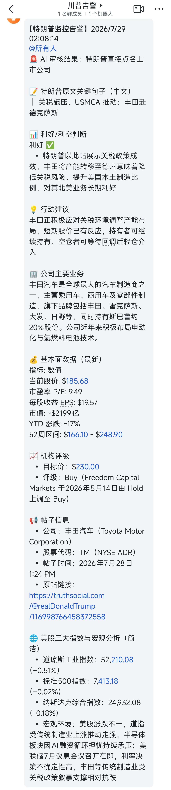

# GrabTrump'sPost - 特朗普 Truth Social 美股监控技能

> 监控特朗普 Truth Social 帖子，当特朗普在原文中直接点名美股上市公司（含 ADR）时，自动生成分析报告并推送到飞书群（手机接收推送通知）。

## 一、简要介绍

本技能通过抓取特朗普 Truth Social 账号（@realDonaldTrump）的最新帖子，由 AI 审核是否"直接点名"某家美股上市公司，一旦命中即生成包含基本面、机构评级、宏观指数的 9 部分分析报告，并自动推送到飞书 Webhook 机器人，触发手机飞书 App 推送通知。

### 跨 Agent 兼容性

本技能**不绑定特定 AI Agent 或平台**，也**不绑定特定机器路径**。核心执行逻辑封装在 `trump_stock_monitor.js`（纯 Node.js 脚本），脚本内部使用 `__dirname` 自动定位技能根目录，所有文件路径均相对于技能根目录。**任何能调用 Node.js 并按输出协议处理的 AI Agent 均可承载**，包括但不限于：

| Agent / 平台         | 自动化任务承载方式                                                   |
| ------------------ | ----------------------------------------------------------- |
| **Trae**           | 使用内置 `Schedule` 工具创建 cron 定时任务（推荐，原生支持）                     |
| **Claude Code**    | 由 LLM 自动确定：可用系统 cron (Linux/macOS)、Task Scheduler (Windows) |
| **CodeX**          | 由 LLM 自动确定：可用系统 cron、launchd (macOS)                        |
| **其他支持自动化的 Agent** | 由 LLM 自动选择合适的调度方式，只要能定时触发 `node trump_stock_monitor.js` 即可  |

只要 Agent 具备以下基础能力，即可承载本技能：

- 能调用 Node.js 执行脚本
- 能通过 WebFetch 工具抓取网页数据（用于获取基本面）
- 能通过定时调度机制触发任务（cron / Task Scheduler / launchd 等）
- 能使用 AskUserQuestion 或等价交互能力（用于告警后交互）

## 技能安装与更新

### 安装

将以下命令复制到你的 AI Agent（如 Trae、Claude Code、CodeX 等）对话框中直接发送，由 LLM 自动安装到当前 Agent 的全局技能目录，安装后全局生效：

```
安装技能 https://github.com/wxdpop/GrabTrump-sPost 到全局技能目录
```

> LLM 会自动识别当前 Agent 类型，将技能克隆到对应的全局技能目录（如 Trae 的 `~/.trae-cn/skills/`），并完成必要的初始化。脚本内部使用 `__dirname` 自定位，无需关心具体路径。

### 更新

将以下命令复制到 Agent 对话框发送即可更新到最新版本：

```
更新全局技能 GrabTrump-sPost https://github.com/wxdpop/GrabTrump-sPost
```

> 更新后无需重新初始化，现有 `config.json` 和定时任务配置会保留（已被 .gitignore 忽略）。

## 二、用户使用方法

### 步骤 1：注册飞书群机器人

1. 打开飞书 PC 端或手机 App，进入要接收告警的**飞书群**
2. 点击群名称 → **设置** → **群机器人**
3. 点击 **添加机器人** → 选择 **自定义机器人（Custom Bot）**
4. 配置机器人：
   - **机器人名称**：任意（建议"特朗普美股监控"）
   - **安全设置**：选择 **自定义关键词**，填写 `特朗普`（脚本默认关键词）
5. 点击 **完成**，复制生成的 **Webhook 地址**（格式：`https://open.feishu.cn/open-apis/bot/v2/hook/xxxxxxxxxxxxxxxxxx`）
6. 保存好该 Webhook 地址，初始化时需要填入

### 步骤 2：准备运行环境

- 安装 **Node.js v16+**（推荐 v18 或 v20 LTS）
- 若未通过上方"技能安装与更新"章节安装，可手动克隆：

```bash
git clone https://github.com/wxdpop/GrabTrump-sPost.git
cd GrabTrump-sPost
```

### 步骤 3：初始化配置

在技能根目录下复制配置示例并编辑：

```bash
cp config.example.json config.json
```

编辑 `config.json`，填入飞书 Webhook 地址：

```json
{
  "feishu": {
    "webhookUrl": "https://open.feishu.cn/open-apis/bot/v2/hook/你的webhook地址",
    "keyword": "特朗普",
    "atAll": true
  },
  "schedule": {
    "intervalHours": 1,
    "timezone": "Asia/Shanghai"
  },
  "monitor": {
    "limit": 20
  }
}
```

字段说明：

| 字段                       | 说明                     |
| ------------------------ | ---------------------- |
| `feishu.webhookUrl`      | 飞书自定义机器人 Webhook 地址    |
| `feishu.keyword`         | 飞书安全关键词（必须与机器人配置一致）    |
| `feishu.atAll`           | 是否 @所有人（true 触发手机推送通知） |
| `schedule.intervalHours` | 执行间隔（小时）               |
| `monitor.limit`          | 每次抓取的最新帖子数量上限          |

### 步骤 4：调用技能初始化

在支持的 AI Agent 中（如 Trae）调用本技能并输入 **"初始化"**，Agent 会引导你完成配置并创建定时任务。

### 步骤 5：验证飞书推送

执行演示模式测试飞书配置是否生效：

```bash
node trump_stock_monitor.js --demo
```

若手机飞书 App 收到测试消息，则配置成功。

## 三、展示效果

### 飞书推送效果



### 报告内容（9 部分模板）

每条告警报告包含以下 9 个部分，严格按顺序输出：

1. 📝 特朗普原文关键句子（中文翻译）
2. 📊 利好/利空判断
3. 💡 行动建议
4. 🏢 公司主要业务
5. 💰 基本面数据（最新股价、P/E、EPS、市值、YTD、52周区间）
6. 📈 机构评级（目标价、评级）
7. 📢 帖子信息（公司名、股票代码、帖子时间、原帖链接）
8. 🌐 美股三大指数与宏观分析（道琼斯、标普500、纳斯达克）

多公司告警时，分多条独立消息分别发送，每条消息开头 @所有人触发手机推送。

## 四、依赖的库

本技能为**纯 Node.js 实现**，仅依赖 Node.js 内置模块，**无需 npm install**：

| 模块      | 用途                  | 是否需安装 |
| ------- | ------------------- | ----- |
| `https` | HTTPS 请求（抓取帖子、发送飞书） | ❌ 内置  |
| `http`  | HTTP 请求（兜底）         | ❌ 内置  |
| `zlib`  | gzip/deflate 解压     | ❌ 内置  |
| `fs`    | 文件读写（配置、历史记录、临时文件）  | ❌ 内置  |
| `path`  | 路径拼接（跨平台兼容）         | ❌ 内置  |

**运行环境要求**：

- Node.js v16+（推荐 v18 或 v20 LTS）
- 无需任何第三方 npm 包

## 五、脚本命令参考

```bash
# 静默抓取最新帖子（默认，定时任务使用）
node trump_stock_monitor.js --limit 20

# 显示进度信息（调试用）
node trump_stock_monitor.js --verbose --limit 20

# 演示模式（强制输出 + 发送飞书测试消息）
node trump_stock_monitor.js --demo

# 清空历史记录（重置已处理帖子 ID）
node trump_stock_monitor.js --reset

# 发送飞书消息（从 temp/ 读取文件，相对路径基于技能根目录自动解析）
node trump_stock_monitor.js --send-feishu "feishu_report.txt"

# 发送飞书消息（绝对路径，跨目录文件）
node trump_stock_monitor.js --send-feishu "/path/to/report.txt"
```

## 六、目录结构

```
GrabTrump'sPost/              # 技能根目录（SKILL.md 所在目录）
├── SKILL.md                  # 技能描述与执行指引（Agent 入口）
├── trump_stock_monitor.js    # 主脚本 v8.3（技能化版本，用 __dirname 自定位）
├── config.json               # 飞书 Webhook 配置（初始化时生成，.gitignore 忽略）
├── config.example.json       # 配置文件示例
├── report_template.md        # 飞书推送报告模板（9 部分）
├── processed_ids.json        # 已处理帖子 ID（运行时自动维护，.gitignore 忽略）
├── .gitignore                # Git 忽略规则
├── README.md                 # 本文件
├── 飞书展示效果图.jpg         # 飞书推送效果展示图
└── temp/                     # 临时文件目录（feishu_report.txt 等，推送后自动清理）
    └── .gitkeep
```

## 七、关键约束

1. **静默执行是硬性约束**：无警报时不得输出任何文字、不弹窗、不发送飞书
2. **"直接点名"判定严格**：必须是特朗普原文中明确提到公司名，转发/图片/关联不算
3. **多公司分多条报告**：不能合并，每条之间用独占一行的 `---` 分隔
4. **模板顺序固定**：9 部分顺序不可调整
5. **ADR 也算美股**：TSM、BABA、JD、TM 等
6. **北京时间 9:00-17:00 静默跳过**：美股未开盘时段无需监控
7. **推送后自动清理 temp/**：保留 .gitkeep，删除其他文件
8. **飞书发送失败不阻断流程**：继续执行告警后交互
9. **路径不硬编码**：所有文件路径均相对于技能根目录，脚本用 `__dirname` 自定位

## 八、故障排查

| 问题                | 解决方案                                          |
| ----------------- | --------------------------------------------- |
| 脚本无输出             | 正常（无新帖子/非监控时段/未点名公司）                          |
| `config.json` 不存在 | 输入"初始化"重新配置，或手动复制 `config.example.json`       |
| 飞书发送失败            | 检查 `config.json` 中 webhookUrl 是否正确、关键词是否匹配    |
| 历史记录异常            | 执行 `node trump_stock_monitor.js --reset` 清空重来 |
| 抓取失败              | 脚本会自动主备切换，AI 可用 WebFetch 兜底访问 trumpstruth.org |
| 临时文件堆积            | 正常情况推送后自动清理；如残留可手动删除 `temp/` 下文件（保留 .gitkeep） |

## License

MIT
